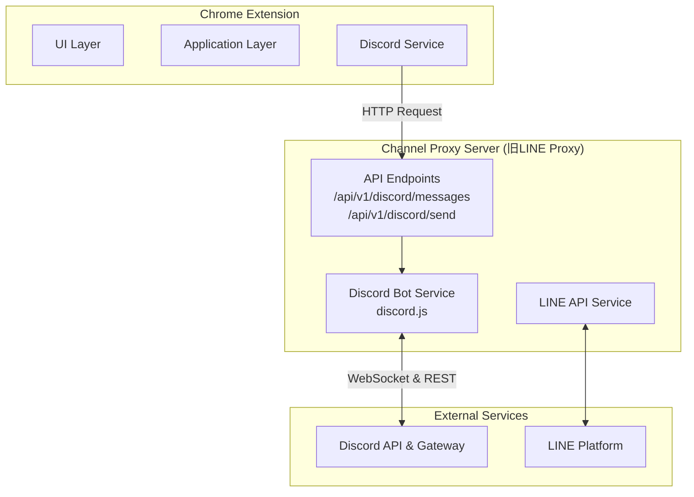

# Discord Bot 統合設計書

**作成日**: 2024年7月16日
**対象**: Discord Botによるメッセージ送受信機能の統合
**設計方針**: 既存のLINEプロキシサーバーを拡張し、安定性と拡張性の高いDiscord連携を実現する。

## 1. 目的と背景

### 1.1 現状の課題
- **送信**: Discord Webhookを利用しており、送信機能しか持たない。Botとしてのインタラクティブな機能が利用できない。
- **受信**: DOM操作を前提とした設計であり、DiscordのUI変更に弱く、不安定である。また、バックグラウンドでのメッセージ取得ができない。
- **規約**: 利用規約上、自動化と判断されるリスクを完全に排除できない。

### 1.2 設計目標
ユーザーからのフィードバック（最終送信判断はユーザーが行うため、Botを利用しても規約違反にはあたらない）と、技術的安定性を考慮し、以下の設計目標を定める。

- **安定したメッセージ送受信**: Discordの公式APIおよびGatewayを利用し、UIの変更に影響されない堅牢な連携を実現する。
- **バックグラウンド受信**: 拡張機能がアクティブでない状態でも、サーバー側でメッセージを受信できる体制を整える。
- **既存インフラの活用**: 新規サーバーを構築せず、既存の`line-proxy-server`を拡張することで、開発・運用コストを抑制する。

## 2. アーキテクチャ変更

### 2.1 全体アーキテクチャ
既存の`line-proxy-server`を`channel-proxy-server`として責務を拡張し、Discord Botの機能を追加する。



### 2.2 変更のポイント
- **Webhook廃止**: 拡張機能はWebhook URLを直接叩かず、プロキシサーバーのAPIを呼び出す。
- **DOM操作廃止**: 拡張機能はDOMからメッセージを読み取らず、プロキシサーバーに問い合わせる。
- **サーバーの役割**: プロキシサーバーがBotとしてDiscord Gatewayに常時接続し、メッセージを受信する。

## 3. プロキシサーバーの機能拡張

### 3.1 プロジェクトの名称変更と構成
- **ディレクトリ名変更**: `line-proxy-server` -> `channel-proxy-server`
- **依存関係追加**: `discord.js`, `dotenv` (環境変数管理の強化)
- **構成ファイル**: `package.json` に `discord.js` を追加。

### 3.2 追加されるファイル
```
channel-proxy-server/src/
├── routes/
│   ├── ...
│   └── discord.routes.ts   # (新規) Discord用APIルート
└── services/
    ├── ...
    └── discord/
        ├── discord.service.ts    # (新規) Discord Botのメインロジック
        └── message-cache.ts    # (新規) 受信メッセージの一時保管
```

### 3.3 APIエンドポイント仕様
`channel-proxy-server/src/routes/discord.routes.ts`

| Method | Endpoint | 説明 | Request Body | Response Body |
| :--- | :--- | :--- | :--- | :--- |
| `POST` | `/api/v1/discord/send` | メッセージを送信する | `{ channelId: string, content: string }` | `{ success: boolean, messageId?: string }` |
| `GET` | `/api/v1/discord/messages` | 未読（または最近の）メッセージを取得する | - | `{ success: boolean, messages: Message[] }` |

### 3.4 Discordサービスの実装 (`discord.service.ts`)
- **責務**: `discord.js`クライアントの初期化、Discord Gatewayへの接続、イベント（`messageCreate`など）のハンドリング。
- **起動処理**: サーバー起動時にBotとしてDiscordにログインし、Gatewayに接続する。
- **メッセージ受信**: `messageCreate`イベントを購読。受信したメッセージは、`message-cache.service.ts`に一時的に保存する。
- **メッセージ送信**: `send`メソッドを実装。指定されたチャンネルIDにメッセージを投稿する。

### 3.5 メッセージキャッシュ (`message-cache.ts`)
- **責務**: Discordから受信したメッセージをメモリ上に一時的に保持する。
- **機能**:
    - `add(message)`: メッセージを追加する。
    - `get(since?)`: 指定時刻以降のメッセージ、または全キャッシュを返す。
    - `clear()`: キャッシュをクリアする。
- **注意**: これは簡易的な実装であり、将来的にはRedisなどの永続的なストアに置き換えることを検討する。

## 4. Chrome拡張機能の修正

### 4.1 `discord.service.ts` の修正
- **`sendMessage`**:
    - 変更前: Webhook URLに直接POSTする。
    - 変更後: プロキシサーバーの `/api/v1/discord/send` エンドポイントにPOSTリクエストを送信する。
- **`getMessages`**:
    - 変更前: 空の配列を返すプレースホルダー。
    - 変更後: プロキシサーバーの `/api/v1/discord/messages` エンドポイントにGETリクエストを送信し、メッセージリストを取得する。

## 5. 設定とデプロイ

### 5.1 必要な環境変数
プロキシサーバーの `.env` ファイルに、以下の環境変数を追加する必要がある。
```
# .env

# Discord Bot
DISCORD_BOT_TOKEN="YOUR_DISCORD_BOT_TOKEN"
DISCORD_CLIENT_ID="YOUR_DISCORD_BOT_CLIENT_ID"
DISCORD_TARGET_GUILD_ID="YOUR_SERVER_ID"

# LINE (既存)
LINE_CHANNEL_ACCESS_TOKEN="..."
LINE_CHANNEL_SECRET="..."
```

### 5.2 Discord Botのセットアップ手順
1. **Discord Developer Portal**で新しいApplicationを作成する。
2. "Bot"タブでBotを作成し、**Tokenをコピー**して`.env`に設定する。
3. **Privileged Gateway Intents**を有効にする。
    - `SERVER MEMBERS INTENT`
    - `MESSAGE CONTENT INTENT`
4. **OAuth2 URL Generator**を使い、以下の権限でBotをサーバーに招待するURLを生成する。
    - **Scopes**: `bot`
    - **Bot Permissions**: `Read Messages/View Channels`, `Send Messages`
5. 生成されたURLにアクセスし、対象のサーバーにBotを招待する。

## 6. 段階的実装計画
1. **[済] 設計**: 本書を作成する。
2. **[次] プロキシサーバー改修**:
    - ディレクトリ名変更と依存関係追加。
    - `discord.service.ts` の雛形と、メッセージ送信API (`/api/v1/discord/send`) を実装する。
3. **拡張機能改修**:
    - `DiscordService`の`sendMessage`を、新しいプロキシAPIを呼び出すように修正する。
4. **結合テスト① (送信)**:
    - Vitestテストで、拡張機能からプロキシ経由でDiscordにメッセージが送信できることを確認する。
5. **プロキシサーバー改修②**:
    - メッセージ受信とキャッシュ機能、およびメッセージ取得API (`/api/v1/discord/messages`) を実装する。
6. **拡張機能改修②**:
    - `DiscordService`の`getMessages`を実装する。
7. **結合テスト② (受信)**:
    - E2Eテスト（Playwright）で、Discordに投稿されたメッセージを拡張機能が取得できることを確認する。 