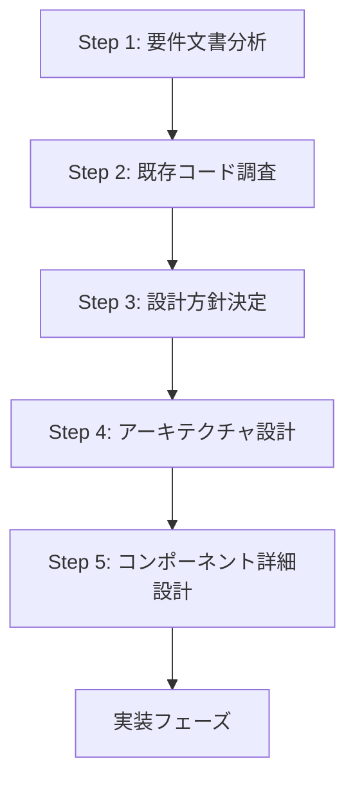
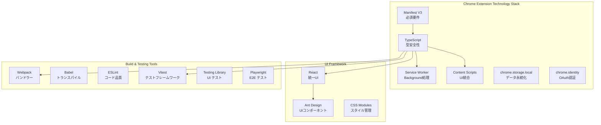
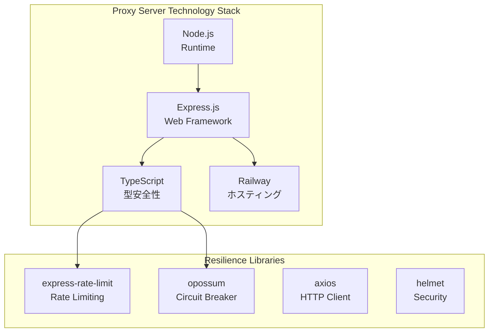
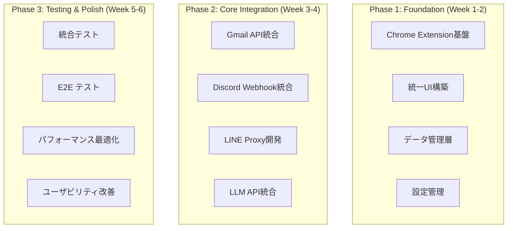
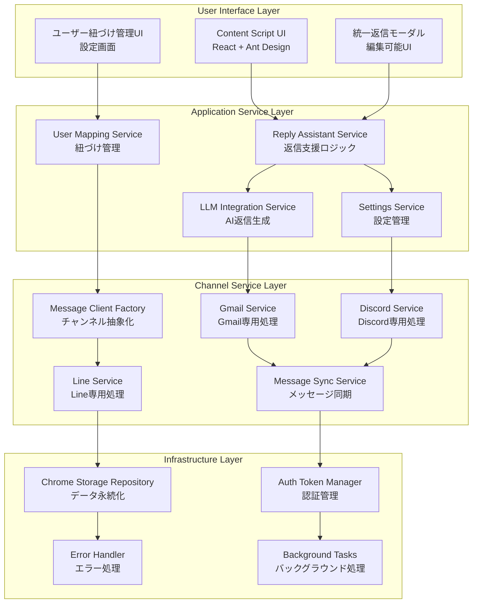
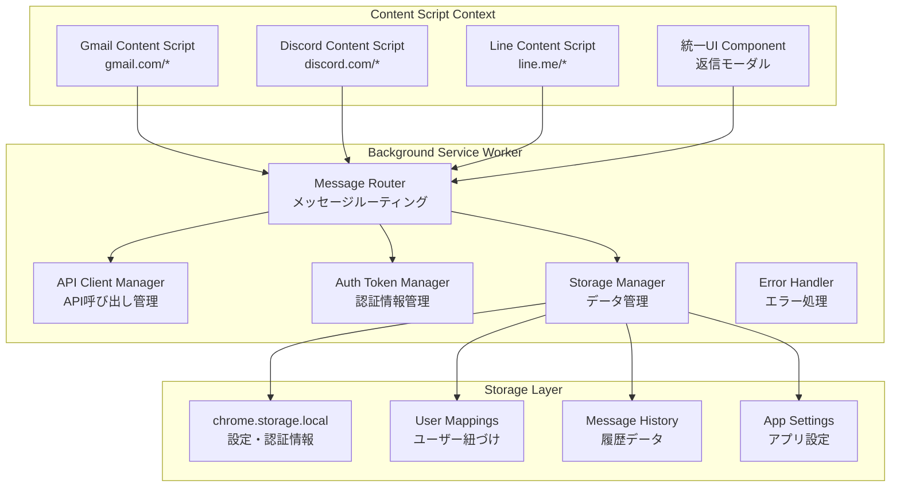
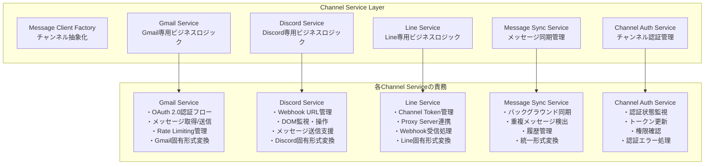
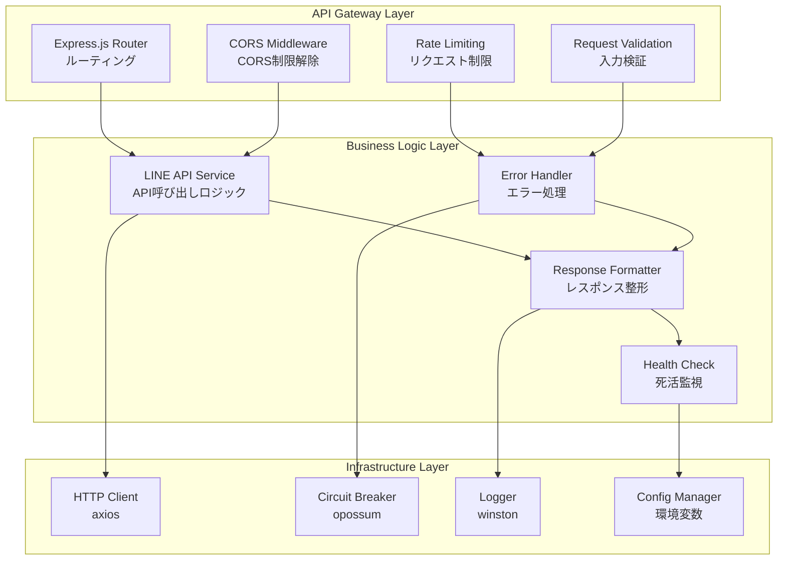
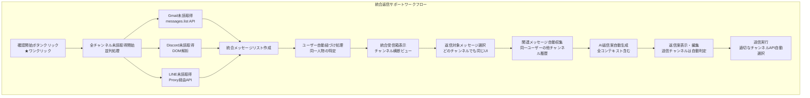
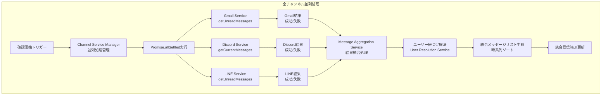

# プロトタイプアーキテクチャ設計書

**作成日**: 2024年1月10日  
**最終更新**: 2024年1月10日  
**対象**: Gmail + Discord + LINE 返信支援システム プロトタイプ  
**設計方針**: 手動返信支援、チャンネル非依存、MVP重視

## 目次

1. [設計プロセス概要](#1-設計プロセス概要)
2. [要件分析](#2-要件分析)
3. [技術調査結果](#3-技術調査結果)
4. [設計方針](#4-設計方針)
5. [システムアーキテクチャ](#5-システムアーキテクチャ)
6. [統合ワークフロー](#6-統合ワークフロー)
7. [技術仕様](#7-技術仕様)
8. [実装ガイダンス](#8-実装ガイダンス)

---

## 1. 設計プロセス概要

### 1.1 設計フロー



### 1.2 設計原則

- **対話型設計アプローチ**: AIの独断判断を禁止し、ユーザー確認を必須
- **段階的実装**: MVP → 段階的機能拡張
- **手動支援**: 完全自動化を避け、ユーザーの手動操作を支援
- **チャンネル非依存**: ユーザーにチャンネルを意識させない統合体験

---

## 2. 要件分析

### 2.1 機能要件

#### 基本機能（Must have）
- **マルチチャネル統合**: Gmail, Discord, Line の3チャネルを統合
- **返信案生成**: LLM（OpenAI等）による自動返信案生成
  - **入力データ**: 対象メッセージ + **ユーザー指定時は他チャンネルのメッセージも追加**
- **編集モーダル**: ワンクリック送信前の編集UI
- **同一ユーザー紐づけ**: **手動設定による紐づけ管理**（C案採用）

#### サブ機能（Must have）
- **統合メッセージ取得**: 各チャネルからの未読メッセージ一括取得
- **統一返信UI**: **全チャンネル共通の返信UI**
- **紐づけ管理UI**: **簡単な紐づけ設定UI**
- **他チャンネルメッセージ表示**: 同一人物の最新メッセージ（**1件**）
- **LLM生成時の他チャンネル参照オプション**

#### Could have（将来実装）
- 複数チャンネル同時表示
- 返信履歴管理
- テンプレート機能
- 紐づけ自動化・補助機能

### 2.2 非機能要件

#### 性能要件
| 項目 | 目標値 | 測定方法 |
|------|--------|----------|
| **UI応答時間** | 200ms以内 | Chrome DevTools |
| **LLM応答時間** | 5秒以内 | API レスポンス測定 |
| **メッセージ送信時間** | 3秒以内 | End-to-End測定 |
| **ストレージアクセス** | 50ms以内 | chrome.storage API測定 |
| **メモリ使用量** | 100MB以内 | Chrome Task Manager |

#### セキュリティ要件
- **Authentication**: OAuth 2.0（Gmail）
- **Data Encryption**: 保存データ暗号化
- **HTTPS Only**: 通信暗号化
- **Local Storage**: データはローカルのみ
- **No Telemetry**: 使用統計送信なし

---

## 3. 技術調査結果

### 3.1 各チャンネルの実装可能性

| チャンネル | 評価 | 推奨方式 | 主要制約 | 実装優先度 |
|------------|------|----------|----------|------------|
| **Gmail** | B（実装可能） | Gmail API v1 + OAuth 2.0 | レート制限250クォータ/秒 | **高** |
| **Discord** | C（条件付き） | Proxy Server + DOM操作 | **完全自動化禁止**、手動支援のみ | **中** |
| **Line** | B（実装可能） | Webhook Proxy Server | CORS制限、従量課金 | **高** |

### 3.2 技術的制約

#### Discord の重要制約
- **2024年7月8日更新**: Discord利用規約で**完全自動化が明示的に禁止**
- **実装可能範囲**: **手動操作支援のみ**（返信案表示、UI補助など）
- **禁止事項**: 自動メッセージ送信、完全自動返信

#### Chrome拡張機能制約
- **Manifest V3**: 必須対応
- **Service Worker**: Background Script代替
- **CSP制約**: Content Security Policy制限
- **CORS制限**: 各チャンネルでプロキシサーバー必要（LINEのみ）

### 3.3 実際の通信パス

| チャンネル | 通信方式 | プロキシ必要性 | 理由 |
|------------|----------|----------------|------|
| **Gmail** | ❌ 直接接続 | 不要 | chrome.identity APIでOAuth対応済み |
| **Discord** | ❌ 直接接続 | 不要 | Webhook URLへの直接POST可能 |
| **LINE** | ✅ プロキシ経由 | **必要** | CORS制限のため |

---

## 4. 設計方針

### 4.1 技術スタック

#### Chrome拡張機能


#### LINE専用プロキシサーバー


### 4.2 アーキテクチャパターン

| パターン | 適用箇所 | 理由 |
|----------|----------|------|
| **Repository Pattern** | データアクセス層 | chrome.storage.local→DB移行の容易性 |
| **Factory Pattern** | MessageClient生成 | チャンネル固有実装の抽象化 |
| **Strategy Pattern** | LLM API切り替え | 複数のLLM プロバイダー対応 |
| **Observer Pattern** | UI状態管理 | リアルタイムUI更新 |
| **Circuit Breaker** | 外部API呼び出し | 耐障害性確保 |

### 4.3 開発フェーズ（4-6週間）



---

## 5. システムアーキテクチャ

### 5.1 全体アーキテクチャ（4層構成）



### 5.2 Chrome拡張機能内部アーキテクチャ



### 5.3 Channel Service Layer 詳細

#### 各Channel Serviceの責務



### 5.4 LINE専用プロキシサーバーアーキテクチャ



---

## 6. 統合ワークフロー

### 6.1 ユーザーワークフロー（チャンネル非依存）



### 6.2 全チャンネル並列処理



### 6.3 統合UI設計

#### 統合受信箱インタフェース
```
┌─────────────────────────────────────────────────────────┐
│                    統合受信箱                           │
├─────────────────────────────────────────────────────────┤
│  [確認開始] [設定] [ユーザー紐づけ管理]                 │
├─────────────────────────────────────────────────────────┤
│  📧 田中太郎 <Gmail>        2分前                       │
│  件名: プロジェクトについて                             │
│  内容: 明日の会議の件で...                [返信]        │
├─────────────────────────────────────────────────────────┤
│  💬 tanaka_discord <Discord>   5分前                    │
│  チャンネル: #general                                   │
│  内容: 今日のタスクは...      [返信]                    │
├─────────────────────────────────────────────────────────┤
│  📱 田中太郎 <LINE>           10分前                    │
│  内容: お疲れさまです！       [返信]                    │
└─────────────────────────────────────────────────────────┘
```

#### 統一返信モーダル
```
┌─────────────────────────────────────────────────────────┐
│                    返信作成                             │
├─────────────────────────────────────────────────────────┤
│  返信先: 田中太郎 (Gmail)                               │
│  元メッセージ: プロジェクトについて                     │
├─────────────────────────────────────────────────────────┤
│  他チャンネルの関連メッセージ:                          │
│  • Discord: 今日のタスクは... (5分前)                  │
│  • LINE: お疲れさまです！ (10分前)                     │
├─────────────────────────────────────────────────────────┤
│  AI生成返信案:                                          │
│  ┌─────────────────────────────────────────────────────┐ │
│  │ お疲れさまです。                                   │ │
│  │ プロジェクトの件、了解いたしました。               │ │
│  │ 明日の会議で詳細を確認させていただきます。         │ │
│  └─────────────────────────────────────────────────────┘ │
├─────────────────────────────────────────────────────────┤
│              [AI再生成] [編集] [送信] [キャンセル]      │
└─────────────────────────────────────────────────────────┘
```

---

## 7. 技術仕様

### 7.1 統一インタフェース定義

#### 基本インタフェース
```typescript
// 統一メッセージクライアント
interface IMessageClient {
  // メッセージ送信
  sendMessage(params: SendMessageParams): Promise<SendMessageResult>;
  
  // メッセージ取得
  getMessages(params: GetMessagesParams): Promise<GetMessagesResult>;
  
  // 認証状態確認
  isAuthenticated(): Promise<boolean>;
  
  // 認証実行
  authenticate(credentials?: any): Promise<AuthResult>;
  
  // チャンネル情報取得
  getChannelInfo(): ChannelInfo;
}

// 送信パラメータ
interface SendMessageParams {
  to: string;           // 送信先ID
  content: string;      // メッセージ内容
  replyTo?: string;     // 返信対象メッセージID
  options?: SendOptions;
}

// 取得パラメータ
interface GetMessagesParams {
  limit?: number;       // 取得件数制限
  unreadOnly?: boolean; // 未読のみ取得
  since?: Date;         // 指定日時以降
  threadId?: string;    // スレッドID指定
}

// 送信オプション
interface SendOptions {
  urgent?: boolean;     // 緊急フラグ
  silent?: boolean;     // 通知無効化
  formatting?: MessageFormat; // メッセージ形式
}

// メッセージ形式
enum MessageFormat {
  PLAIN_TEXT = 'plain',
  MARKDOWN = 'markdown',
  HTML = 'html'
}

// 統一メッセージ形式
interface Message {
  id: string;
  from: string;
  to: string;
  content: string;
  timestamp: Date;
  isUnread: boolean;
  channel: ChannelType;
  threadId?: string;    // スレッド/会話ID
  replyToId?: string;   // 返信元メッセージID
  attachments?: Attachment[]; // 添付ファイル
  raw?: any; // 各チャンネル固有の生データ
}

// 添付ファイル
interface Attachment {
  id: string;
  name: string;
  type: string;
  size: number;
  url?: string;
}

// API結果型
interface SendMessageResult {
  success: boolean;
  messageId?: string;
  error?: ApiError;
}

interface GetMessagesResult {
  success: boolean;
  messages: Message[];
  hasMore: boolean;
  nextToken?: string;
  error?: ApiError;
}

interface AuthResult {
  success: boolean;
  token?: string;
  expiresAt?: Date;
  error?: ApiError;
}

// エラー型
interface ApiError {
  code: string;
  message: string;
  details?: any;
}

// チャンネル情報
interface ChannelInfo {
  type: ChannelType;
  name: string;
  isConnected: boolean;
  lastSync?: Date;
  rateLimits?: RateLimit;
}

interface RateLimit {
  requestsPerSecond: number;
  requestsPerHour: number;
  remaining: number;
  resetAt: Date;
}
```

#### Application Service インタフェース
```typescript
// 返信支援サービス
interface IReplyAssistantService {
  // 全チャンネル未読取得
  fetchAllUnreadMessages(): Promise<UnifiedInboxResult>;
  
  // AI返信案生成
  generateReply(context: ReplyContext): Promise<ReplyGenerationResult>;
  
  // 関連メッセージ取得
  getRelatedMessages(userId: string, originalMessage: Message): Promise<Message[]>;
}

// ユーザー紐づけサービス
interface IUserMappingService {
  // ユーザー紐づけ作成
  createMapping(mapping: UserMappingRequest): Promise<UserMapping>;
  
  // ユーザー紐づけ取得
  getMapping(userId: string): Promise<UserMapping | null>;
  
  // 自動紐づけ解決
  resolveUserMappings(messages: Message[]): Promise<ResolvedMessage[]>;
  
  // 紐づけ一覧取得
  getAllMappings(): Promise<UserMapping[]>;
}

// LLM統合サービス
interface ILLMIntegrationService {
  // 返信生成
  generateReply(prompt: string, context: any): Promise<string>;
  
  // プロンプト最適化
  optimizePrompt(context: ReplyContext): string;
  
  // 使用量取得
  getUsageStats(): Promise<LLMUsageStats>;
}

// 設定サービス
interface ISettingsService {
  // 設定取得
  getSettings(): Promise<AppSettings>;
  
  // 設定更新
  updateSettings(settings: Partial<AppSettings>): Promise<void>;
  
  // 設定リセット
  resetSettings(): Promise<void>;
}
```

#### Repository インタフェース
```typescript
// ストレージリポジトリ
interface IChromeStorageRepository {
  // データ保存
  save<T>(key: string, data: T): Promise<void>;
  
  // データ取得
  get<T>(key: string): Promise<T | null>;
  
  // データ削除
  remove(key: string): Promise<void>;
  
  // 全データ取得
  getAll(): Promise<Record<string, any>>;
  
  // データ存在確認
  exists(key: string): Promise<boolean>;
}

// 認証トークン管理
interface IAuthTokenManager {
  // トークン保存
  saveToken(channel: ChannelType, token: AuthToken): Promise<void>;
  
  // トークン取得
  getToken(channel: ChannelType): Promise<AuthToken | null>;
  
  // トークン削除
  removeToken(channel: ChannelType): Promise<void>;
  
  // トークン更新
  refreshToken(channel: ChannelType): Promise<AuthToken>;
  
  // 有効性確認
  validateToken(channel: ChannelType, token: AuthToken): Promise<boolean>;
}
```

### 7.2 データモデル

#### 基本型定義
```typescript
enum ChannelType {
  GMAIL = 'gmail',
  DISCORD = 'discord',
  LINE = 'line'
}

enum MessageStatus {
  UNREAD = 'unread',
  READ = 'read',
  REPLIED = 'replied',
  ARCHIVED = 'archived'
}

enum Priority {
  LOW = 'low',
  NORMAL = 'normal',
  HIGH = 'high',
  URGENT = 'urgent'
}
```

#### ユーザー関連データモデル
```typescript
// ユーザー紐づけ情報
interface UserMapping {
  id: string; // UUID
  name: string; // 表示名
  channels: {
    [ChannelType.GMAIL]?: {
      email: string;
      userId: string;
      displayName?: string;
    };
    [ChannelType.DISCORD]?: {
      username: string;
      userId: string;
      discriminator?: string;
      guildId?: string;
      displayName?: string;
    };
    [ChannelType.LINE]?: {
      displayName: string;
      userId: string;
      pictureUrl?: string;
    };
  };
  avatar?: string; // 統一アバターURL
  priority: Priority; // ユーザー重要度
  tags: string[]; // カスタムタグ
  lastActivity: Date; // 最終活動日時
  isActive: boolean; // アクティブ状態
  createdAt: Date;
  updatedAt: Date;
}

// ユーザー紐づけ要求
interface UserMappingRequest {
  name: string;
  channels: Partial<UserMapping['channels']>;
  avatar?: string;
  priority?: Priority;
  tags?: string[];
}

// 解決済みメッセージ（ユーザー紐づけ適用後）
interface ResolvedMessage extends Message {
  resolvedUser?: UserMapping; // 紐づけ解決されたユーザー
  relatedMessages?: Message[]; // 関連メッセージ
  priority: Priority; // 計算された優先度
}
```

#### アプリケーション設定データモデル
```typescript
// アプリケーション設定
interface AppSettings {
  // 一般設定
  general: {
    language: string; // 言語設定
    theme: 'light' | 'dark' | 'auto'; // テーマ
    autoFetch: boolean; // 自動取得有効
    fetchInterval: number; // 取得間隔（分）
    maxMessageHistory: number; // 履歴保持件数
  };
  
  // 通知設定
  notifications: {
    enabled: boolean; // 通知有効
    sound: boolean; // 音声通知
    desktop: boolean; // デスクトップ通知
    priorities: Priority[]; // 通知対象優先度
  };
  
  // AI設定
  ai: {
    provider: 'openai' | 'anthropic' | 'google'; // プロバイダー
    model: string; // 使用モデル
    temperature: number; // 創造性パラメータ
    maxTokens: number; // 最大トークン数
    customPrompt?: string; // カスタムプロンプト
  };
  
  // チャンネル設定
  channels: {
    [ChannelType.GMAIL]: GmailSettings;
    [ChannelType.DISCORD]: DiscordSettings;
    [ChannelType.LINE]: LineSettings;
  };
  
  // UI設定
  ui: {
    compactMode: boolean; // コンパクト表示
    showAvatars: boolean; // アバター表示
    groupByUser: boolean; // ユーザー別グループ化
    defaultSortOrder: 'timestamp' | 'priority' | 'channel'; // デフォルトソート
  };
}

// チャンネル別設定
interface GmailSettings {
  enabled: boolean;
  labels?: string[]; // 対象ラベル
  excludeLabels?: string[]; // 除外ラベル
  maxResults: number; // 最大取得件数
}

interface DiscordSettings {
  enabled: boolean;
  webhookUrl?: string;
  guildIds?: string[]; // 対象サーバー
  channelIds?: string[]; // 対象チャンネル
}

interface LineSettings {
  enabled: boolean;
  channelAccessToken?: string;
  proxyUrl: string; // プロキシサーバーURL
}
```

#### 認証関連データモデル
```typescript
// 認証トークン
interface AuthToken {
  accessToken: string;
  refreshToken?: string;
  expiresAt: Date;
  scope?: string[];
  tokenType: 'Bearer' | 'OAuth';
}

// 認証状態
interface AuthState {
  channel: ChannelType;
  isAuthenticated: boolean;
  user?: {
    id: string;
    email?: string;
    name?: string;
    avatar?: string;
  };
  lastAuth: Date;
  expiresAt?: Date;
}
```

#### 統合受信箱データモデル
```typescript
// 統合受信箱結果
interface UnifiedInboxResult {
  success: boolean;
  messages: ResolvedMessage[];
  channelResults: {
    [ChannelType.GMAIL]: ChannelFetchResult;
    [ChannelType.DISCORD]: ChannelFetchResult;
    [ChannelType.LINE]: ChannelFetchResult;
  };
  totalUnread: number;
  lastFetch: Date;
  error?: ApiError;
}

// チャンネル別取得結果
interface ChannelFetchResult {
  success: boolean;
  messageCount: number;
  error?: ApiError;
  fetchTime: number; // ミリ秒
}

// 返信コンテキスト
interface ReplyContext {
  originalMessage: Message;
  relatedMessages: Message[];
  userMapping?: UserMapping;
  conversationHistory: Message[];
  userPreferences: {
    tone: 'formal' | 'casual' | 'friendly';
    language: string;
    includeContext: boolean;
  };
}

// 返信生成結果
interface ReplyGenerationResult {
  success: boolean;
  reply: string;
  confidence: number; // 0-1の信頼度
  alternatives?: string[]; // 代替案
  tokensUsed: number;
  error?: ApiError;
}

// LLM使用統計
interface LLMUsageStats {
  totalRequests: number;
  totalTokens: number;
  successRate: number;
  averageResponseTime: number;
  monthlyCost: number;
  lastUpdated: Date;
}
```

#### ストレージキー定義
```typescript
// ストレージキー定数
const STORAGE_KEYS = {
  // 認証関連
  AUTH_TOKENS: 'auth_tokens',
  AUTH_STATE: 'auth_state',
  
  // ユーザーデータ
  USER_MAPPINGS: 'user_mappings',
  MESSAGE_HISTORY: 'message_history',
  
  // アプリケーション設定
  APP_SETTINGS: 'app_settings',
  UI_STATE: 'ui_state',
  
  // 統計・ログ
  USAGE_STATS: 'usage_stats',
  ERROR_LOG: 'error_log',
} as const;

type StorageKey = typeof STORAGE_KEYS[keyof typeof STORAGE_KEYS];
```

### 7.3 API呼び出し頻度とコスト

| チャンネル | API呼び出しタイミング | 頻度 | 月間コスト見積 |
|------------|---------------------|------|---------------|
| **Gmail** | ユーザー要求時のみ | 1-10回/日 | $0（無料枠内） |
| **Discord** | ユーザー要求時のみ | 1-10回/日 | $0（Webhook無料） |
| **LINE** | ユーザー要求時のみ | 1-10回/日 | $1-5/月 |
| **LLM** | ユーザー要求時のみ | 1-5回/日 | $5-20/月 |
| **Proxy** | ユーザー要求時のみ | 1-10回/日 | $0-2/月 |
| **合計** | - | - | **$6-27/月** |

### 7.4 セキュリティ要件

#### 認証・認可
- **Gmail**: OAuth 2.0 + chrome.identity API
- **Discord**: Webhook URL管理
- **LINE**: Channel Access Token + プロキシ経由

#### データ保護
- **Local Storage Only**: データはローカルのみ
- **暗号化**: 認証トークンの暗号化保存
- **HTTPS**: 全通信の暗号化
- **最小権限**: 必要最小限の権限のみ要求

---

## 8. プロジェクト構成設計

### 8.1 全体プロジェクト構造

```
multi-channel-reply-assistant/
├── README.md                           # プロジェクト概要
├── package.json                        # NPMパッケージ設定
├── tsconfig.json                       # TypeScript設定
├── .gitignore                          # Git除外設定
├── .env.example                        # 環境変数例
│
├── chrome-extension/                   # Chrome拡張機能
│   ├── manifest.json                   # 拡張機能マニフェスト
│   ├── package.json                    # 拡張機能用依存関係
│   ├── webpack.config.js               # ビルド設定
│   ├── tsconfig.json                   # 拡張機能用TypeScript設定
│   │
│   ├── src/                           # ソースコード
│   │   ├── background/                # Background Service Worker
│   │   ├── content-scripts/           # Content Scripts
│   │   ├── components/                # React Components
│   │   ├── services/                  # Business Logic Services
│   │   ├── repositories/              # Data Access Layer
│   │   ├── types/                     # TypeScript型定義
│   │   ├── utils/                     # ユーティリティ
│   │   └── assets/                    # 静的リソース
│   │
│   ├── public/                        # 公開リソース
│   │   ├── icons/                     # アイコンファイル
│   │   ├── _locales/                  # 多言語リソース
│   │   └── popup.html                 # ポップアップHTML
│   │
│   └── dist/                          # ビルド出力
│
├── line-proxy-server/                 # LINE専用プロキシサーバー
│   ├── package.json                   # サーバー用依存関係
│   ├── tsconfig.json                  # サーバー用TypeScript設定
│   ├── Dockerfile                     # Docker設定
│   ├── railway.json                   # Railway設定
│   │
│   ├── src/                          # サーバーソースコード
│   │   ├── routes/                   # API ルート
│   │   ├── middleware/               # Express ミドルウェア
│   │   ├── services/                 # ビジネスロジック
│   │   ├── types/                    # 型定義
│   │   ├── utils/                    # ユーティリティ
│   │   └── app.ts                    # Express アプリケーション
│   │
│   └── dist/                         # サーバービルド出力
│
├── shared/                           # 共通ライブラリ
│   ├── types/                        # 共通型定義
│   ├── constants/                    # 定数定義
│   └── utils/                        # 共通ユーティリティ
│
├── tests/                            # テストファイル
│   ├── unit/                         # ユニットテスト
│   ├── integration/                  # 統合テスト
│   ├── e2e/                          # E2Eテスト
│   └── mocks/                        # モックデータ
│
└── docs/                             # ドキュメント
    ├── design/                       # 設計文書
    ├── api/                          # API仕様書
    └── development/                  # 開発ガイド
```

### 8.2 Chrome拡張機能詳細構成

#### 8.2.1 manifest.json 構造
```json
{
  "manifest_version": 3,
  "name": "Multi-Channel Reply Assistant",
  "version": "1.0.0",
  "description": "AI-powered unified reply assistant for Gmail, Discord, and LINE",
  
  "permissions": [
    "storage",
    "identity",
    "activeTab",
    "https://gmail.com/*",
    "https://discord.com/*",
    "https://line.me/*"
  ],
  
  "background": {
    "service_worker": "dist/background/service-worker.js"
  },
  
  "content_scripts": [
    {
      "matches": ["https://mail.google.com/*"],
      "js": ["dist/content-scripts/gmail.js"],
      "css": ["dist/content-scripts/gmail.css"]
    },
    {
      "matches": ["https://discord.com/*"],
      "js": ["dist/content-scripts/discord.js"],
      "css": ["dist/content-scripts/discord.css"]
    },
    {
      "matches": ["https://line.me/*"],
      "js": ["dist/content-scripts/line.js"],
      "css": ["dist/content-scripts/line.css"]
    }
  ],
  
  "action": {
    "default_popup": "popup.html",
    "default_icon": {
      "16": "icons/icon16.png",
      "32": "icons/icon32.png",
      "48": "icons/icon48.png",
      "128": "icons/icon128.png"
    }
  }
}
```

#### 8.2.2 ソースコード構成

##### Background Service Worker
```
src/background/
├── service-worker.ts                  # メインサービスワーカー
├── message-router.ts                  # メッセージルーティング
├── auth-manager.ts                    # 認証管理
├── storage-manager.ts                 # ストレージ管理
└── error-handler.ts                   # エラーハンドリング
```

##### Content Scripts
```
src/content-scripts/
├── base/                             # 共通ベースクラス
│   ├── base-content-script.ts        # 基底クラス
│   ├── ui-injector.ts                # UI注入機能
│   └── dom-observer.ts               # DOM監視機能
│
├── gmail/                            # Gmail専用
│   ├── gmail-content-script.ts       # Gmail Content Script
│   ├── gmail-dom-parser.ts           # Gmail DOM解析
│   └── gmail-ui-integration.ts       # Gmail UI統合
│
├── discord/                          # Discord専用
│   ├── discord-content-script.ts     # Discord Content Script
│   ├── discord-dom-parser.ts         # Discord DOM解析
│   └── discord-ui-integration.ts     # Discord UI統合
│
└── line/                             # LINE専用
    ├── line-content-script.ts        # LINE Content Script
    ├── line-dom-parser.ts            # LINE DOM解析
    └── line-ui-integration.ts        # LINE UI統合
```

##### React Components
```
src/components/
├── common/                           # 共通コンポーネント
│   ├── Button/
│   │   ├── Button.tsx
│   │   ├── Button.types.ts
│   │   └── Button.styles.css
│   ├── Modal/
│   │   ├── Modal.tsx
│   │   ├── Modal.types.ts
│   │   └── Modal.styles.css
│   └── LoadingSpinner/
│       ├── LoadingSpinner.tsx
│       └── LoadingSpinner.styles.css
│
├── inbox/                           # 受信箱関連
│   ├── UnifiedInbox/
│   │   ├── UnifiedInbox.tsx         # 統合受信箱
│   │   ├── UnifiedInbox.types.ts
│   │   └── UnifiedInbox.styles.css
│   ├── MessageCard/
│   │   ├── MessageCard.tsx          # メッセージカード
│   │   ├── MessageCard.types.ts
│   │   └── MessageCard.styles.css
│   └── ChannelIndicator/
│       ├── ChannelIndicator.tsx     # チャンネル表示
│       └── ChannelIndicator.styles.css
│
├── reply/                           # 返信関連
│   ├── ReplyModal/
│   │   ├── ReplyModal.tsx           # 返信モーダル
│   │   ├── ReplyModal.types.ts
│   │   └── ReplyModal.styles.css
│   ├── ReplyEditor/
│   │   ├── ReplyEditor.tsx          # 返信エディタ
│   │   └── ReplyEditor.styles.css
│   └── ContextPanel/
│       ├── ContextPanel.tsx         # コンテキストパネル
│       └── ContextPanel.styles.css
│
├── settings/                        # 設定関連
│   ├── SettingsModal/
│   │   ├── SettingsModal.tsx        # 設定モーダル
│   │   └── SettingsModal.styles.css
│   ├── ChannelSettings/
│   │   ├── ChannelSettings.tsx      # チャンネル設定
│   │   └── ChannelSettings.styles.css
│   └── UserMappingManager/
│       ├── UserMappingManager.tsx   # ユーザー紐づけ管理
│       └── UserMappingManager.styles.css
│
└── popup/                           # ポップアップ
    ├── PopupApp.tsx                 # ポップアップメインアプリ
    ├── QuickStats.tsx               # クイック統計表示
    └── ActionButtons.tsx            # アクションボタン群
```

##### Service Layer
```
src/services/
├── application/                     # Application Service Layer
│   ├── reply-assistant.service.ts   # 返信支援サービス
│   ├── user-mapping.service.ts      # ユーザー紐づけサービス
│   ├── llm-integration.service.ts   # LLM統合サービス
│   └── settings.service.ts          # 設定サービス
│
├── channel/                         # Channel Service Layer
│   ├── base/
│   │   ├── message-client.interface.ts # 統一インタフェース
│   │   ├── base-message-client.ts      # 基底クラス
│   │   └── message-client.factory.ts   # ファクトリー
│   ├── gmail/
│   │   ├── gmail.service.ts             # Gmail サービス
│   │   ├── gmail-auth.service.ts        # Gmail 認証
│   │   └── gmail-api.client.ts          # Gmail API クライアント
│   ├── discord/
│   │   ├── discord.service.ts           # Discord サービス
│   │   ├── discord-webhook.client.ts    # Discord Webhook
│   │   └── discord-dom.service.ts       # Discord DOM操作
│   └── line/
│       ├── line.service.ts              # LINE サービス
│       ├── line-proxy.client.ts         # LINE Proxy クライアント
│       └── line-webhook.service.ts      # LINE Webhook
│
└── infrastructure/                  # Infrastructure Layer
    ├── chrome-storage.repository.ts  # Chrome Storage Repository
    ├── auth-token.manager.ts          # 認証トークン管理
    ├── error-handler.service.ts       # エラーハンドリング
    └── background-tasks.manager.ts    # バックグラウンドタスク
```

##### TypeScript型定義
```
src/types/
├── core/                           # 核となる型定義
│   ├── message.types.ts            # メッセージ関連型
│   ├── channel.types.ts            # チャンネル関連型
│   ├── user.types.ts               # ユーザー関連型
│   └── api.types.ts                # API関連型
│
├── services/                       # サービス層型定義
│   ├── reply-assistant.types.ts    # 返信支援型
│   ├── user-mapping.types.ts       # ユーザー紐づけ型
│   ├── llm.types.ts                # LLM関連型
│   └── settings.types.ts           # 設定型
│
├── infrastructure/                 # インフラ層型定義
│   ├── storage.types.ts            # ストレージ型
│   ├── auth.types.ts               # 認証型
│   └── error.types.ts              # エラー型
│
└── external/                       # 外部API型定義
    ├── gmail-api.types.ts          # Gmail API型
    ├── discord-api.types.ts        # Discord API型
    └── line-api.types.ts           # LINE API型
```

### 8.3 LINE Proxy Server 構成

```
line-proxy-server/src/
├── app.ts                          # Express アプリケーション設定
├── server.ts                       # サーバー起動エントリーポイント
│
├── routes/                         # API ルート
│   ├── index.ts                    # ルート統合
│   ├── line-api.routes.ts          # LINE API プロキシルート
│   ├── health.routes.ts            # ヘルスチェック
│   └── webhook.routes.ts           # Webhook受信
│
├── middleware/                     # Express ミドルウェア
│   ├── cors.middleware.ts          # CORS設定
│   ├── rate-limit.middleware.ts    # レート制限
│   ├── validation.middleware.ts    # リクエスト検証
│   ├── auth.middleware.ts          # 認証確認
│   └── error.middleware.ts         # エラーハンドリング
│
├── services/                       # ビジネスロジック
│   ├── line-api.service.ts         # LINE API サービス
│   ├── circuit-breaker.service.ts  # サーキットブレーカー
│   ├── health-check.service.ts     # ヘルスチェック
│   └── webhook.service.ts          # Webhook処理
│
├── types/                          # 型定義
│   ├── line.types.ts               # LINE関連型
│   ├── api.types.ts                # API型
│   └── config.types.ts             # 設定型
│
├── utils/                          # ユーティリティ
│   ├── logger.ts                   # ログ機能
│   ├── config.ts                   # 設定管理
│   └── validation.ts               # バリデーション
│
└── config/                         # 設定ファイル
    ├── database.ts                 # DB設定（将来用）
    ├── redis.ts                    # Redis設定（将来用）
    └── constants.ts                # 定数定義
```

### 8.4 設定ファイル類

#### 8.4.1 TypeScript設定
```json
// chrome-extension/tsconfig.json
{
  "compilerOptions": {
    "target": "ES2020",
    "module": "ESNext",
    "moduleResolution": "node",
    "strict": true,
    "esModuleInterop": true,
    "skipLibCheck": true,
    "forceConsistentCasingInFileNames": true,
    "resolveJsonModule": true,
    "declaration": true,
    "outDir": "./dist",
    "baseUrl": "./src",
    "paths": {
      "@/*": ["*"],
      "@/components/*": ["components/*"],
      "@/services/*": ["services/*"],
      "@/types/*": ["types/*"],
      "@/utils/*": ["utils/*"]
    }
  },
  "include": ["src/**/*"],
  "exclude": ["node_modules", "dist", "tests"]
}
```

#### 8.4.2 パッケージ構成
```json
// chrome-extension/package.json
{
  "name": "multi-channel-reply-assistant",
  "version": "1.0.0",
  "description": "AI-powered unified reply assistant",
  "scripts": {
    "build": "webpack --mode production",
    "dev": "webpack --mode development --watch",
    "test": "vitest run",
    "test:watch": "vitest",
    "lint": "eslint src/**/*.{ts,tsx}",
    "type-check": "tsc --noEmit"
  },
  "devDependencies": {
    "@types/chrome": "^0.0.246",
    "@types/react": "^18.2.0",
    "@types/react-dom": "^18.2.0",
    "typescript": "^5.0.0",
    "webpack": "^5.0.0",
    "webpack-cli": "^5.0.0",
    "vitest": "^1.0.0"
  },
  "dependencies": {
    "react": "^18.2.0",
    "react-dom": "^18.2.0",
    "antd": "^5.0.0"
  }
}
```

### 8.5 ファイル命名規則

#### 8.5.1 TypeScript ファイル
- **Component**: `PascalCase.tsx` (例: `ReplyModal.tsx`)
- **Service**: `kebab-case.service.ts` (例: `reply-assistant.service.ts`)
- **Types**: `kebab-case.types.ts` (例: `message.types.ts`)
- **Utils**: `kebab-case.ts` (例: `date-formatter.ts`)
- **Constants**: `UPPER_SNAKE_CASE.ts` (例: `API_ENDPOINTS.ts`)

#### 8.5.2 CSS ファイル
- **Component Style**: `ComponentName.styles.css`
- **Global Style**: `global.css`, `variables.css`

#### 8.5.3 Test ファイル
- **Unit Test**: `*.test.ts` (例: `reply-assistant.service.test.ts`)
- **Integration Test**: `*.integration.test.ts`
- **E2E Test**: `*.e2e.test.ts`

### 8.6 ビルド・配布構成

#### Chrome拡張機能ビルド出力
```
chrome-extension/dist/
├── manifest.json                   # コピーされたマニフェスト
├── background/
│   └── service-worker.js           # バンドルされたService Worker
├── content-scripts/
│   ├── gmail.js                    # Gmail Content Script
│   ├── discord.js                  # Discord Content Script
│   └── line.js                     # LINE Content Script
├── popup/
│   ├── popup.html                  # ポップアップHTML
│   └── popup.js                    # ポップアップスクリプト
└── assets/
    ├── icons/                      # アイコンファイル
    └── _locales/                   # 多言語リソース
```

---

## 付録

### A. 参考資料

#### 技術ドキュメント
- [Chrome Extensions Manifest V3](https://developer.chrome.com/docs/extensions/develop/migrate/what-is-mv3)
- [Gmail API Documentation](https://developers.google.com/workspace/gmail/api/guides)
- [Discord Developer Documentation](https://discord.com/developers/docs/)
- [LINE Messaging API Documentation](https://developers.line.biz/ja/docs/messaging-api/)

#### 設計パターン
- [Repository Pattern](https://docs.microsoft.com/en-us/dotnet/architecture/microservices/microservice-ddd-cqrs-patterns/infrastructure-persistence-layer-design)
- [Factory Pattern](https://refactoring.guru/design-patterns/factory-method)
- [Circuit Breaker Pattern](https://docs.microsoft.com/en-us/azure/architecture/patterns/circuit-breaker)

### B. 変更履歴

| 日付 | バージョン | 変更内容 |
|------|------------|----------|
| 2024-01-10 | 1.0 | 初版作成 |
| 2024-01-10 | 1.1 | 統合ワークフロー追加 |
| 2024-01-10 | 2.0 | **設計者版確定**<br/>• 実装詳細削除（開発環境、実装順序、デプロイ等）<br/>• 詳細インタフェース定義追加<br/>• データモデル拡充<br/>• 設計者適切範囲に限定 |
| 2024-01-10 | 2.1 | **プロジェクト構成設計追加**<br/>• 全体プロジェクト構造定義<br/>• Chrome拡張機能詳細ファイル構成<br/>• LINE Proxyサーバー構成<br/>• 設定ファイル・命名規則・ビルド構成追加 |

---

**文書作成者**: AI設計エージェント  
**文書種別**: アーキテクチャ設計書（設計者版）  
**対象読者**: 実装者、プロジェクトマネージャー、技術責任者  
**承認者**: プロジェクト責任者  
**次回レビュー予定**: 実装開始前 